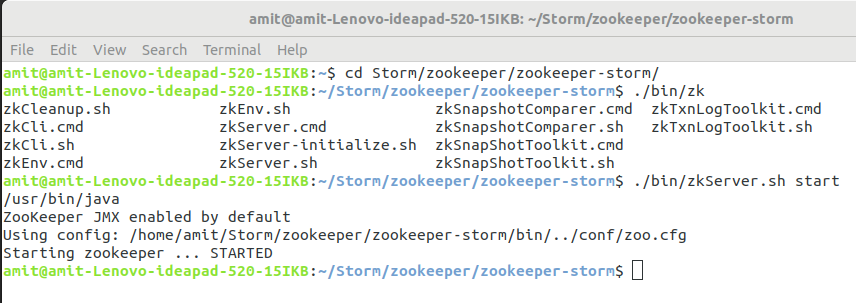
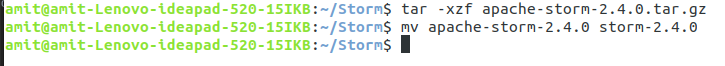
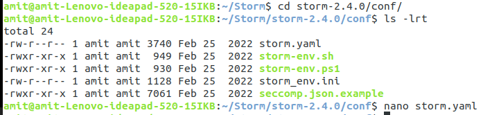
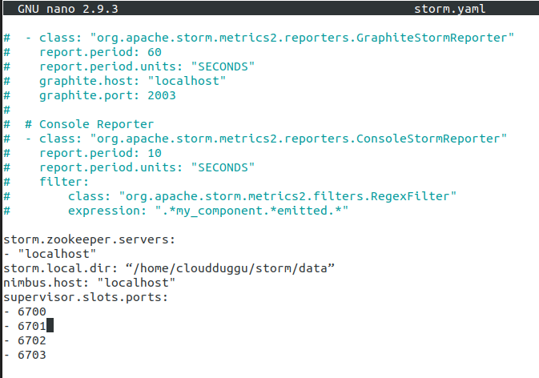
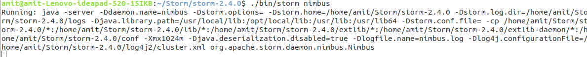
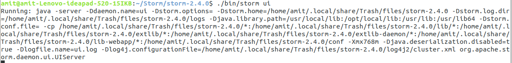

Install Apache Storm on Ubuntu 18.04

https://storm.apache.org/index.html

## Documentation

change the version number for URL, it contains: https://storm.apache.org/releases/2.4.0/index.html

* Basics of Storm
* Layers on top of Storm
* Setup and Deploying
* Intermediate
* Debugging
* Integration With External Systems, and Other Libraries
* Container, Resource Management System Integration
* Advanced

## Download Storm

1. Select latest version as per compability from below URL.
2. Select apache-storm-{version}.tar.gz

   https://downloads.apache.org/storm/

## Installation Process

The installation process will follow three steps.

1. Java Installation
2. Apache Zookeeper Installation
3. Apache Storm Installation

## **1. Java Installation**

#### Please use the below command to check whether Java is installed on your system.

`$ java -version`

If Java is installed them you will see the below output. We have installed the openJDK 11 version.

```
amit@amit-Lenovo-ideapad-520-15IKB:~$ java -version
openjdk version "11.0.15" 2022-04-19
OpenJDK Runtime Environment (build 11.0.15+10-Ubuntu-0ubuntu0.18.04.1)
OpenJDK 64-Bit Server VM (build 11.0.15+10-Ubuntu-0ubuntu0.18.04.1, mixed mode, sharing)
```

#### If Java is not installed then follow the below steps to install Java.

1. **Install openJDK 11**
   Please use the below command to install openJDK 8.

```
$ sudo apt-get install openjdk-11-jdk
$ java -version
```

OR

```
$ sudo add-apt-repository ppa:openjdk-r/ppa
$ sudo apt-get update
$ sudo apt install openjdk-11-jdk
$ java -version
```

OR

```
$ sudo apt-get install openjdk-11-jre
$ sudo apt-get install openjdk-11-jdk-headless
$ sudo apt-get install maven
```

Press CTRL + O to save the file. Once the file is saved press CTRL+X to exit from the editor. After this run the below command to reflect changes in the current running terminal.

`$ source ~/.bashrc`

2. **Set Java Environment Variable Path**
   Once the java installation is completed then set the JAVA_HOME path in the “.bashrc” file.
   Open “.bashrc” file using below command and put the path of Java.

```
$ nano .bashrc

export JAVA_HOME=/usr/lib/jvm/java-11-openjdk-amd64/
export PATH=$JAVA_HOME/bin:JAVA_HOME/bin:$PATH
```

3 **Verify Java Installation**
Please verify Java installation using the “java –version” command.

`java -version`

## **2. Apache Zookeeper Installation**

https://zookeeper.apache.org/index.html

Let us see the installation process of the Zookeeper.

### **Step 2.1 Download ZooKeeper**

Please download ZooKeeper from the below link. select latest version of zookeeper from below link:

https://archive.apache.org/dist/zookeeper/

`$wget https://archive.apache.org/dist/zookeeper/zookeeper-{version}/apache-zookeeper-{version}-bin.tar.gz`

OR simply dowload selected version, in this case: "apache-zookeeper-3.8.0-bin.tar.gz" from URL: https://archive.apache.org/dist/zookeeper/zookeeper-3.8.0/

### **Step 2.2 Extract tar file**

Use the below command to extract the tar file and rename it to “zookeeper”.

```
$ tar –xzf apche-zookeeper-3.6.1-bin.tar.gz
$ mv apche-zookeeper-3.6.1-bin zookeeper-storm
```

### **Step 2.3 Configuration of Zookeeper**

We will create a directory called “data” under the zookeeper. Now we will create a configuration file from the sample file and put the below configuration.

```
~/Storm/zookeeper-3.8.0$ mkdir data
~/Storm/zookeeper-3.8.0$ cd conf/
~/Storm/zookeeper-3.8.0/conf$ cp zoop_sample.cfg zoo.cfg
~/Storm/zookeeper/zookeeper-storm/conf$ nano zoo.cfg
```

Now put the below parameters in the “zoo.cfg file.

```
tickTime=2000
initLimit=10
syncLimit=5
dataDir=/home/amit/Storm/zookeeper/zookeeper-3.8.0/data
clientPort=2181
```

if above not working try adding below two lines in conf/zoo.cfg

```
admin.enableServer=true
admin.serverPort=9990

```

Press CTRL + O to save the file. Once the file is saved press CTRL+X to exit from the editor.

### **Step 2.4 Start ZooKeeper Server**

After configuration, we can start the zookeeper server.

```
~/Storm/zookeeper-3.8.0$ ./bin/zkServer.sh start`
```



**Step 2.5 Start ZooKeeper CLI**

CLI of zookeeper can be started using the below command.

```
~/Storm/zookeeper-3.8.0$ ./bin/zkCli.sh'
```


## **3. Apache Storm Installation**

Let us follow the below steps to install Apache Storm.

### **3.1 Download Storm**

Download Apache Storm from the below link. select latest version of Apache Storm from below link:

https://downloads.apache.org/storm/

**$ wget https://downloads.apache.org/storm/apache-storm-{version}/apache-storm-{version}.tar.gz

OR simply dowload selected version, in this case: "apache-storm-2.4.0.tar.gz" from URL: https://downloads.apache.org/storm/apache-storm-2.4.0/

**3.2 Extract Storm tar File**

Use the below command to extract the tar file of the Storm.

```
~$ tar -xzf apache-storm-2.4.0.tar.gz
~$ mv apache-storm-2.4.0 storm-2.4.0
```



### **3.3 Configuration of Apache Storm**

Now go to the “conf” directory of the Storm and follow the below steps.

`~/Storm/storm-2.4.0/conf$ nano storm.yaml`



Put below parameters in the storm.yaml file.

```
# with below config it's not working
storm.zookeeper.servers:
- "localhost"
storm.local.dir: “/home/cloudduggu/storm/data”
nimbus.host: "localhost"
supervisor.slots.ports:
- 6700
- 6701
- 6702
- 6703
```

OR try with below. In Storm version  **2.1.0** version `nimbus.host` has been replaced by the array option `nimbus.seeds`.

```
#working with this configuration

storm.zookeeper.servers:
     - "localhost"
nimbus.seeds: [ "localhost" ]
```



Press CTRL + O to save the file. Once the file is saved press CTRL+X to exit from the editor.

### **3.4 Start Nimbus Node**

Use the below command to start the Nimbus node.

`~/Storm/storm-2.4.0$ ./bin/storm nimbus`



Use the below command to start the Supervisor.

`~/Storm/storm-2.4.0$ ./bin/storm supervisor`

Use the below command to start the UI.

`~/Storm/storm-2.4.0$ ./bin/storm ui`




### 

**3.6 Open Storm UI in Web Browser**

Open a web browser and type this command [http://localhost:8080](http://localhost:8080/) .

Note1: If Storm UI is not starting on 8080 port which is the default port and throwing below error "Exception in thread "main" java.lang.RuntimeException: java.io.IOException: Failed to bind to 0.0.0.0/0.0.0.0:8080" then change the port in “storm/conf/ storm.yaml” configuration file and make it “ui.port: 8081” after that start Strom UI.

Once Storm UI is opened in the web browser post that we can see the below screen.


# Common Error while starting server:


### use below command for `java.net.BindException: Address already in use`

---

Solution: (kill the process)

$ lsof -i :8080

or

$ sudo lsof -i -P -n | grep LISTEN

$ kill -9 {PID}


### 500 Server Error (NimbusLeaderNotFoundException)

---


```
org.apache.storm.utils.NimbusLeaderNotFoundException: Could not find leader nimbus from seed hosts [localhost]. Did you specify a valid list of nimbus hosts for config nimbus.seeds?
	at org.apache.storm.utils.NimbusClient.getConfiguredClientAs(NimbusClient.java:250)
	at org.apache.storm.utils.NimbusClient.getConfiguredClientAs(NimbusClient.java:179)
	at org.apache.storm.utils.NimbusClient.getConfiguredClient(NimbusClient.java:138)
	at org.apache.storm.daemon.ui.resources.StormApiResource.getClusterConfiguration(StormApiResource.java:116)
	at java.base/jdk.internal.reflect.NativeMethodAccessorImpl.invoke0(Native Method)
	at java.base/jdk.internal.reflect.NativeMethodAccessorImpl.invoke(NativeMethodAccessorImpl.java:62)
	at java.base/jdk.internal.reflect.DelegatingMethodAccessorImpl.invoke(DelegatingMethodAccessorImpl.java:43)
	at java.base/java.lang.reflect.Method.invoke(Method.java:566)
	at org.glassfish.jersey.server.model.internal.ResourceMethodInvocationHandlerFactory.lambda$static$0(ResourceMethodInvocationHandlerFactory.java:52)
	at org.glassfish.jersey.server.model.internal.AbstractJavaResourceMethodDispatcher$1.run(AbstractJavaResourceMethodDispatcher.java:124)
	at org.glassfish.jersey.server.model.internal.AbstractJavaResourceMethodDispatcher.invoke(AbstractJavaResourceMethodDispatcher.java:167)
	at org.glassfish.jersey.server.model.internal.JavaResourceMethodDispatcherProvider$ResponseOutInvoker.doDispatch(JavaResourceMethodDispatcherProvider.java:176)
	at org.glassfish.jersey.server.model.internal.AbstractJavaResourceMethodDispatcher.dispatch(AbstractJavaResourceMethodDispatcher.java:79)
	at org.glassfish.jersey.server.model.ResourceMethodInvoker.invoke(ResourceMethodInvoker.java:469)
	at org.glassfish.jersey.server.model.ResourceMethodInvoker.apply(ResourceMethodInvoker.java:391)
	at org.glassfish.jersey.server.model.ResourceMethodInvoker.apply(ResourceMethodInvoker.java:80)
	at org.glassfish.jersey.server.ServerRuntime$1.run(ServerRuntime.java:253)
	at org.glassfish.jersey.internal.Errors$1.call(Errors.java:248)
	at org.glassfish.jersey.internal.Errors$1.call(Errors.java:244)
	at org.glassfish.jersey.internal.Errors.process(Errors.java:292)
	at org.glassfish.jersey.internal.Errors.process(Errors.java:274)
	at org.glassfish.jersey.internal.Errors.process(Errors.java:244)
	at org.glassfish.jersey.process.internal.RequestScope.runInScope(RequestScope.java:265)
	at org.glassfish.jersey.server.ServerRuntime.process(ServerRuntime.java:232)
	at org.glassfish.jersey.server.ApplicationHandler.handle(ApplicationHandler.java:680)
	at org.glassfish.jersey.servlet.WebComponent.serviceImpl(WebComponent.java:392)
	at org.glassfish.jersey.servlet.WebComponent.service(WebComponent.java:346)
	at org.glassfish.jersey.servlet.ServletContainer.service(ServletContainer.java:365)
	at org.glassfish.jersey.servlet.ServletContainer.service(ServletContainer.java:318)
	at org.glassfish.jersey.servlet.ServletContainer.service(ServletContainer.java:205)
	at org.eclipse.jetty.servlet.ServletHolder.handle(ServletHolder.java:867)
	at org.eclipse.jetty.servlet.ServletHandler$CachedChain.doFilter(ServletHandler.java:1623)
	at org.apache.storm.daemon.ui.filters.HeaderResponseServletFilter.doFilter(HeaderResponseServletFilter.java:62)
	at org.eclipse.jetty.servlet.ServletHandler$CachedChain.doFilter(ServletHandler.java:1610)
	at org.apache.storm.daemon.drpc.webapp.ReqContextFilter.handle(ReqContextFilter.java:83)
	at org.apache.storm.daemon.drpc.webapp.ReqContextFilter.doFilter(ReqContextFilter.java:70)
	at org.eclipse.jetty.servlet.ServletHandler$CachedChain.doFilter(ServletHandler.java:1610)
	at org.apache.storm.logging.filters.AccessLoggingFilter.handle(AccessLoggingFilter.java:46)
	at org.apache.storm.logging.filters.AccessLoggingFilter.doFilter(AccessLoggingFilter.java:38)
	at org.eclipse.jetty.servlet.ServletHandler$CachedChain.doFilter(ServletHandler.java:1610)
	at org.eclipse.jetty.servlets.CrossOriginFilter.handle(CrossOriginFilter.java:311)
	at org.eclipse.jetty.servlets.CrossOriginFilter.doFilter(CrossOriginFilter.java:265)
	at org.eclipse.jetty.servlet.ServletHandler$CachedChain.doFilter(ServletHandler.java:1610)
	at org.eclipse.jetty.servlet.ServletHandler.doHandle(ServletHandler.java:540)
	at org.eclipse.jetty.server.handler.ScopedHandler.nextHandle(ScopedHandler.java:255)
	at org.eclipse.jetty.server.session.SessionHandler.doHandle(SessionHandler.java:1588)
	at org.eclipse.jetty.server.handler.ScopedHandler.nextHandle(ScopedHandler.java:255)
	at org.eclipse.jetty.server.handler.ContextHandler.doHandle(ContextHandler.java:1345)
	at org.eclipse.jetty.server.handler.ScopedHandler.nextScope(ScopedHandler.java:203)
	at org.eclipse.jetty.servlet.ServletHandler.doScope(ServletHandler.java:480)
	at org.eclipse.jetty.server.session.SessionHandler.doScope(SessionHandler.java:1557)
	at org.eclipse.jetty.server.handler.ScopedHandler.nextScope(ScopedHandler.java:201)
	at org.eclipse.jetty.server.handler.ContextHandler.doScope(ContextHandler.java:1247)
	at org.eclipse.jetty.server.handler.ScopedHandler.handle(ScopedHandler.java:144)
	at org.eclipse.jetty.server.handler.HandlerWrapper.handle(HandlerWrapper.java:132)
	at org.eclipse.jetty.server.Server.handle(Server.java:502)
	at org.eclipse.jetty.server.HttpChannel.handle(HttpChannel.java:364)
	at org.eclipse.jetty.server.HttpConnection.onFillable(HttpConnection.java:260)
	at org.eclipse.jetty.io.AbstractConnection$ReadCallback.succeeded(AbstractConnection.java:305)
	at org.eclipse.jetty.io.FillInterest.fillable(FillInterest.java:103)
	at org.eclipse.jetty.io.ChannelEndPoint$2.run(ChannelEndPoint.java:118)
	at org.eclipse.jetty.util.thread.strategy.EatWhatYouKill.runTask(EatWhatYouKill.java:333)
	at org.eclipse.jetty.util.thread.strategy.EatWhatYouKill.doProduce(EatWhatYouKill.java:310)
	at org.eclipse.jetty.util.thread.strategy.EatWhatYouKill.tryProduce(EatWhatYouKill.java:168)
	at org.eclipse.jetty.util.thread.strategy.EatWhatYouKill.run(EatWhatYouKill.java:126)
	at org.eclipse.jetty.util.thread.ReservedThreadExecutor$ReservedThread.run(ReservedThreadExecutor.java:366)
	at org.eclipse.jetty.util.thread.QueuedThreadPool.runJob(QueuedThreadPool.java:765)
	at org.eclipse.jetty.util.thread.QueuedThreadPool$2.run(QueuedThreadPool.java:683)
	at java.base/java.lang.Thread.run(Thread.java:829)
```

Solution:
