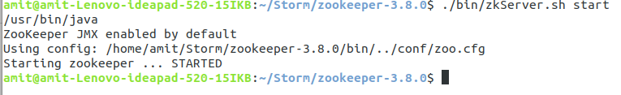

Install Apache Storm on Ubuntu 18.04

https://storm.apache.org/index.html

## Documentation

change the version number for URL, it contains: https://storm.apache.org/releases/2.4.0/index.html

* Basics of Storm
* Layers on top of Storm
* Setup and Deploying
* Intermediate
* Debugging
* Integration With External Systems, and Other Libraries
* Container, Resource Management System Integration
* Advanced

## Download Storm

1. Select latest version as per compability from below URL.
2. Select apache-storm-{version}.tar.gz

   https://downloads.apache.org/storm/

## Installation Process

The installation process will follow three steps.

1. Java Installation
2. Apache Zookeeper Installation
3. Apache Storm Installation

## **1. Java Installation**

#### Please use the below command to check whether Java is installed on your system.

`$ java -version`

If Java is installed them you will see the below output. We have installed the openJDK 11 version.

```amit@amit-Lenovo-ideapad-520-15IKB:~$ java -version```
```openjdk version "11.0.15" 2022-04-19```
```OpenJDK Runtime Environment (build 11.0.15+10-Ubuntu-0ubuntu0.18.04.1)```
```OpenJDK 64-Bit Server VM (build 11.0.15+10-Ubuntu-0ubuntu0.18.04.1, mixed mode, sharing)```

#### If Java is not installed then follow the below steps to install Java.

1. **Install openJDK 11**
   Please use the below command to install openJDK 8.

`$ sudo apt-get install openjdk-11-jdk`
`java -version`

OR

`sudo add-apt-repository ppa:openjdk-r/ppa`
`sudo apt-get update`
`sudo apt install openjdk-11-jdk`
`java -version`

Press CTRL + O to save the file. Once the file is saved press CTRL+X to exit from the editor. After this run the below command to reflect changes in the current running terminal.

`$ source ~/.bashrc`

2. **Set Java Environment Variable Path**
   Once the java installation is completed then set the JAVA_HOME path in the “.bashrc” file.
   Open “.bashrc” file using below command and put the path of Java.

`$ nano .bashrc`

`export JAVA_HOME=/usr/lib/jvm/java-11-openjdk-amd64/`
`export PATH=$JAVA_HOME/bin:$PATH`

3 **Verify Java Installation**
Please verify Java installation using the “java –version” command.

`java -version`

## **2. Apache Zookeeper Installation**

https://zookeeper.apache.org/index.html

Let us see the installation process of the Zookeeper.

### **Step 2.1 Download ZooKeeper**

Please download ZooKeeper from the below link. select latest version of zookeeper from below link:

https://archive.apache.org/dist/zookeeper/

`$wget https://archive.apache.org/dist/zookeeper/zookeeper-{version}/apache-zookeeper-{version}-bin.tar.gz`

OR simply dowload selected version, in this case: "apache-zookeeper-3.8.0-bin.tar.gz" from URL: https://archive.apache.org/dist/zookeeper/zookeeper-3.8.0/

### **Step 2.2 Extract tar file**

Use the below command to extract the tar file and rename it to “zookeeper”.

`$ tar –xzf apche-zookeeper-3.6.1-bin.tar.gz`
`$ mv apche-zookeeper-3.6.1-bin zookeeper-storm`

### **Step 2.3 Configuration of Zookeeper**

We will create a directory called “data” under the zookeeper. Now we will create a configuration file from the sample file and put the below configuration.

`~/Storm/zookeeper/zookeeper-storm$ mkdir data`
`~/Storm/zookeeper/zookeeper-storm$ cd conf/`
`~/Storm/zookeeper/zookeeper-storm/conf$ cp zoop_sample.cfg zoo.cfg`
`~/Storm/zookeeper/zookeeper-storm/conf$ nano zoo.cfg`

Now put the below parameters in the “zoo.cfg file.

`tickTime=2000`
`initLimit=10`
`syncLimit=5`
`dataDir=/home/amit/Storm/zookeeper/zookeeper-storm/data`
`clientPort=2181`

Press CTRL + O to save the file. Once the file is saved press CTRL+X to exit from the editor.

### **Step 2.4 Start ZooKeeper Server**

After configuration, we can start the zookeeper server.

`~/zookeeper$ ./bin/zkServer.sh start`



**Step 2.5 Start ZooKeeper CLI**

CLI of zookeeper can be started using the below command.

`~/zookeeper$ ./bin/zkCli.sh'


## **3. Apache Storm Installation**

Let us follow the below steps to install Apache Storm.

### **3.1 Download Storm**

Download Apache Storm from the below link. select latest version of Apache Storm from below link:

https://downloads.apache.org/storm/

**$ wget https://downloads.apache.org/storm/apache-storm-{version}/apache-storm-{version}.tar.gz

OR simply dowload selected version, in this case: "apache-storm-2.4.0.tar.gz" from URL: https://downloads.apache.org/storm/apache-storm-2.4.0/

**3.2 Extract Storm tar File**

Use the below command to extract the tar file of the Storm.

`~$ *tar -xzf apache-storm-2.2.0.tar.gz*`

`~$ *mv apache-storm-2.2.0 storm*`


### **3.3 Configuration of Apache Storm**

Now go to the “conf” directory of the Storm and follow the below steps.

`~/Storm/storm-2.4.0/conf$ nano storm.yaml`


Put below parameters in the storm.yaml file.

storm.zookeeper.servers:
- &#34;localhost&#34;
storm.local.dir: “/home/cloudduggu/storm/data”
nimbus.host: &#34;localhost&#34;
supervisor.slots.ports:
- 6700
- 6701
- 6702
- 6703


Press CTRL + O to save the file. Once the file is saved press CTRL+X to exit from the editor.

### **3.4 Start Nimbus Node**

Use the below command to start the Nimbus node.

`~/Storm/storm-2.4.0$ ./bin/storm nimbus`


Use the below command to start the Nimbus node.

`~/Storm/storm-2.4.0$ ./bin/storm ui`


### **3.6 Open Storm UI in Web Browser**

Open a web browser and type this command [http://localhost:8080](http://localhost:8080/) .

Note1: If Storm UI is not starting on 8080 port which is the default port and throwing below error "Exception in thread "main" java.lang.RuntimeException: java.io.IOException: Failed to bind to 0.0.0.0/0.0.0.0:8080" then change the port in “storm/conf/ storm.yaml” configuration file and make it “ui.port: 8081” after that start Strom UI.


Once Storm UI is opened in the web browser post that we can see the below screen.


